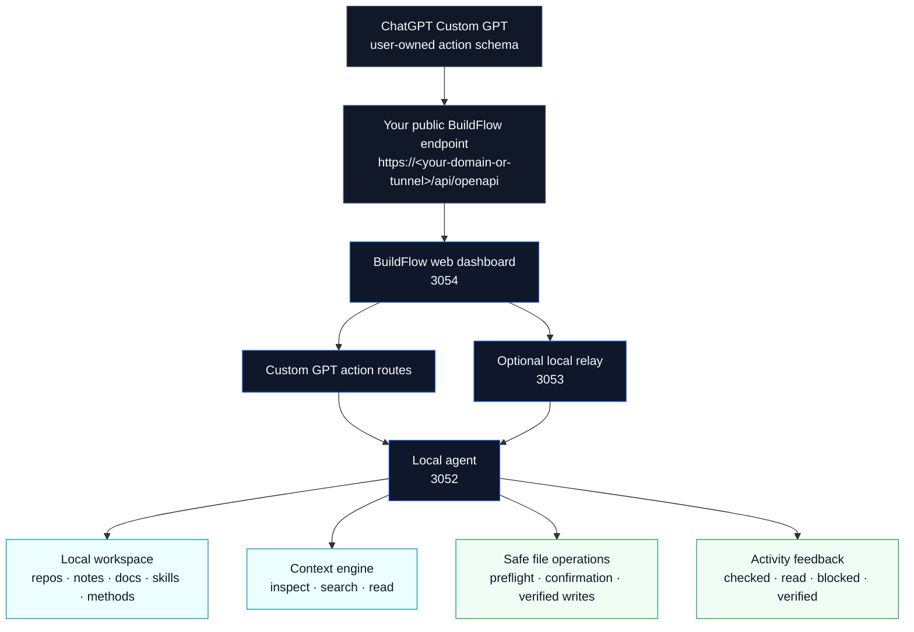

BuildFlow

BuildFlow is a local-first planning and handoff layer for AI-native builders.
It connects a Custom GPT to your real repositories and notes so it can inspect, read, plan, and safely write back to connected local sources.

If you already think in ChatGPT and build in Codex CLI, Claude Code, or your IDE, BuildFlow is the bridge that keeps the work grounded in your actual repo state.

## Who it is for

BuildFlow is for solo developers, indie hackers, founder-operators, and small teams that want AI help without giving up local control.

It is most useful when you want to:

- inspect the files that actually exist in a repo
- read exact local source files or search then read
- turn a rough idea into a structured execution packet
- safely write repo-local changes when policy allows
- preflight a write before changing anything

## Public beta path

For the public GitHub beta, use the Local path:

1. `pnpm install`
2. `pnpm local:restart`
3. Open `http://127.0.0.1:3054/dashboard`

The beta release note is here:

- [`docs/product/releases/buildflow-v1.2.13-beta.md`](docs/product/releases/buildflow-v1.2.13-beta.md)

## What v1.2.13-beta adds

BuildFlow v1.2.13-beta adds user-facing activity feedback for Custom GPT conversations.

It keeps the same safety model, but now returns structured progress metadata so the GPT can explain what BuildFlow checked, read, planned, blocked, wrote, or verified.

It adds:

- a repo-agnostic `repo_app_write` policy
- a guarded `repo_app_maintainer` profile for delete, move, rename, mkdir, and rmdir tasks
- activity metadata on status, source, read, inspect, and write actions
- concise progress phases such as checking, reading, planning, preflight, writing, verifying, blocked, and completed
- clear post-action summaries like "Write was verified" or "Needs confirmation"
- the same `dryRun` / `preflight`, confirmation, and safety boundaries as before

BuildFlow still cannot control ChatGPT’s native action loading label, which will show the endpoint configured in your Custom GPT. The new feedback layer improves the assistant’s own narration before and after each action.

## Transparent activity feedback

BuildFlow now returns concise activity summaries with action responses.

When the Custom GPT instructions are updated, users can see what BuildFlow checked, read, preflighted, changed, blocked, or verified.

This improves conversation clarity, but it does not replace ChatGPT’s native action loading label.

If you want a dashboard-side activity stream, treat that as a separate future UI enhancement. That feed is planned in the roadmap, but it is not implemented yet.

## Safety model

BuildFlow is designed to be useful without being permissive.

The current write policy still blocks:

- `.env` and `.env.*`
- private keys and credential-like files
- path traversal and absolute paths outside the repo
- `.git/**`
- `node_modules/**`
- `.next/**`
- `dist/**`
- `build/**`
- `coverage/**`

Some paths still require explicit confirmation, including lockfiles, GitHub workflows, `LICENSE`, Prisma migrations, and package dependency changes.
Delete, move, rename, mkdir, and rmdir are also policy-checked and confirmation-gated when appropriate.

BuildFlow only treats a write as successful when the response includes `verified:true`.

For the broader maintainer release history, see the current beta note at [`docs/product/releases/buildflow-v1.2.13-beta.md`](docs/product/releases/buildflow-v1.2.13-beta.md).

## How to use with a Custom GPT

When the OpenAPI action schema changes:

1. Reimport or paste the updated schema in the GPT editor.
2. Save and update the GPT action definition.
3. Start a new chat if the old action definition was cached.
4. Restart BuildFlow only when the runtime code changed.

For the free GitHub Local path, import the OpenAPI schema from your own BuildFlow endpoint:

- local reference file: [`docs/openapi.chatgpt.json`](docs/openapi.chatgpt.json)
- local running endpoint: `http://127.0.0.1:3054/api/openapi`
- public Custom GPT endpoint: `https://<your-domain-or-tunnel>/api/openapi`

Use your own BuildFlow endpoint, such as a local endpoint, tunnel, reverse proxy, or domain you control.

The GPT instructions live in:

- [`docs/CUSTOM_GPT_INSTRUCTIONS.md`](docs/CUSTOM_GPT_INSTRUCTIONS.md)

## What this beta can and cannot do

It can:

- inspect connected sources
- read exact files
- search then read
- write allowed repo-local files
- preflight a write with `dryRun` / `preflight`
- return structured policy errors when a path is blocked

It cannot:

- bypass the policy
- write secrets or traversal paths
- write generated/vendor/runtime directories
- claim success without `verified:true`
- run git actions through BuildFlow tools
- broadly delete, move, or rename files

## Quick start

BuildFlow Local runs on your machine.

1. Clone the repo
2. Run `pnpm install`
3. Run `pnpm local:restart`
4. Open `http://127.0.0.1:3054/dashboard`

If you already have a local setup, use the beta release note and the Custom GPT import guide as the canonical paths for the current beta surface.

## Product docs

For the canonical product index and release history, see [`docs/product/README.md`](docs/product/README.md).

## Architecture

BuildFlow runs three services locally:

Service roles:

- **ChatGPT Custom GPT**: The user-created GPT that imports your BuildFlow action schema.
- **Your public BuildFlow endpoint**: A tunnel, reverse proxy, or domain you control for Custom GPT access.
- **Web dashboard (`3054`)**: Local UI and Custom GPT action routes.
- **Relay (`3053`)**: Optional local routing layer for action traffic.
- **Local agent (`3052`)**: Source indexing, context reads, packet generation, and policy-checked file operations.

The free GitHub beta is self-hosted. Your Custom GPT should call your own endpoint, and the agent only works inside connected local sources with BuildFlow’s write policy applied before any file change.

Two execution modes:

- `direct-agent` uses the local agent on port 3052.
- `relay-agent` routes through the relay on port 3053.
